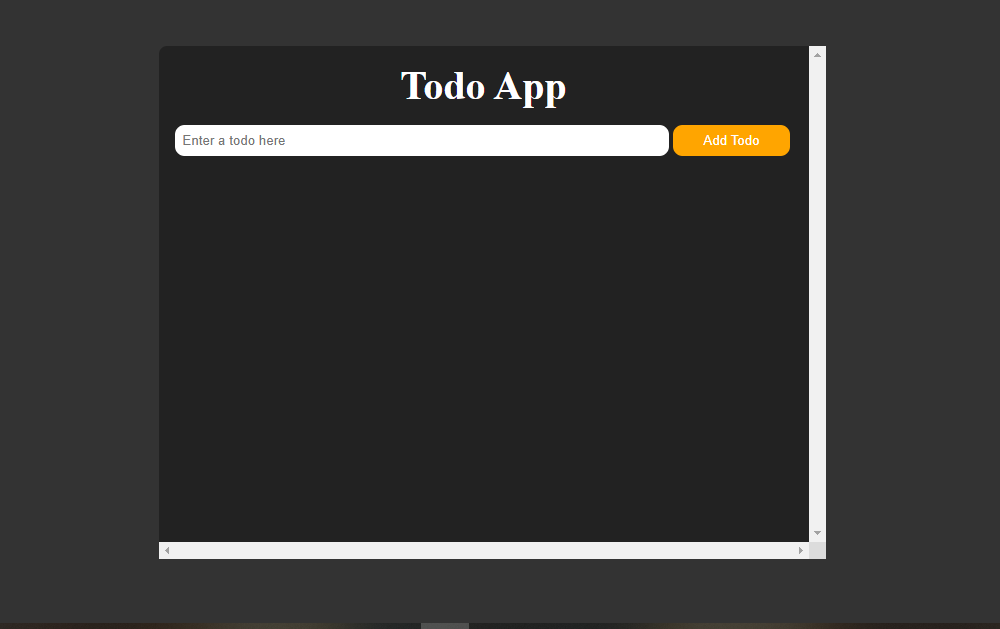

# To-Do List Website

This is a simple to-do list web application built with HTML, CSS, and JavaScript. It allows users to add and delete tasks, providing a basic tool for task organization.

## Features

- **Add Tasks**: Quickly add tasks to your to-do list.
- **Delete Tasks**: Remove tasks when completed.
- **Responsive Design**: Mobile-friendly interface.
- **Task Management**: Organize and manage tasks in a simple layout.

## Technologies Used

- **HTML**: Structure of the website.
- **CSS**: Styling for layout and task list design.
- **JavaScript**: Logic for adding, deleting, and managing tasks.

